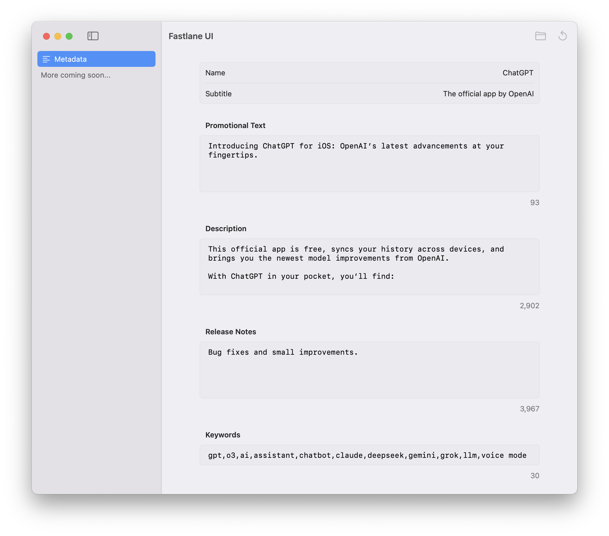

# Fastlane UI

UI wrapper for fastlane

## Features
- Edit all your app's metadata in one place
- Metadata is automatically loaded and saved
- File paths matching fastlane's format
- Helpers like character count against App Store Connect limits

## Potential Roadmap
This is very much a work in progress, would love to develop this into a fully featured app for all types of fastlane actions.

- [ ] Screenshots
- [ ] Multiple projects
- [ ] Multiple localizations/platforms, auto-detection
- [ ] Run fastlane actions within the app
- [ ] UI for fastlane actions with parameters
- [ ] TestFlight
- [ ] App Store

I built this for my own use, but would love for it to be useful for others! If you have any feedback or feature requests, please let me know.